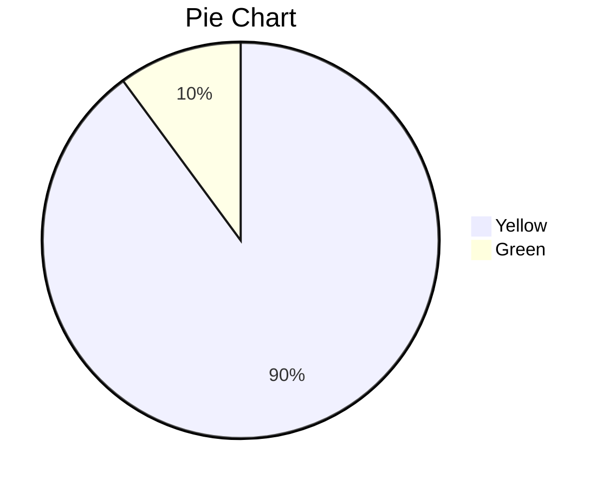

# Homework for week 4 of DE Zoomcamp


### Question 1

61648442

You can find my repo for the dbt part [here](https://github.com/PandaKata/dbt-zoomcamp).

Query:

```
SELECT COUNT(1) 
FROM `sonorous-house-375411.production.fact_trips`
WHERE EXTRACT(YEAR FROM pickup_datetime) IN (2019,2020)
```

### Question 2

I don't know, how to not make the chart use rounded numbers. But the values are actually 89.9 & 10.1 .




### Question 3


Contents of the staging file:

```
{{config(materialized='view') }}

select 
-- identifiers
    {{ dbt_utils.surrogate_key(['dispatching_base_num', 'pickup_datetime']) }} as tripid,
    dispatching_base_num,
    cast(pulocationid as integer) as  pickup_locationid,
    cast(dolocationid as integer) as dropoff_locationid,
    Affiliated_base_number as aff_base_number,
    cast(SR_Flag as numeric) as sr_flag,
    
    -- timestamps
    cast(pickup_datetime as timestamp) as pickup_datetime,
    cast(dropoff_datetime as timestamp) as dropoff_datetime


from {{ source('staging', 'fhv_tripdata') }}

-- dbt build --m <model.sql> --var 'is_test_run: false'


  limit 100


```

43244696


### Question 4

Contents of the fact_fhv_trips.sql:

```
{{config(materialized='table')}}

with fhv_data as (
    select *
    from {{ ref('stg_fhv_tripdata') }}
),

dim_zones as (
    select * from {{ ref('dim_zones') }}
    where borough != 'Unknown'
)

select 
    fhv_data.tripid,
    fhv_data.dispatching_base_num,
    fhv_data.pickup_locationid,
    fhv_data.dropoff_locationid,
    fhv_data.aff_base_number,
    fhv_data.sr_flag,
    fhv_data.pickup_datetime,
    fhv_data.dropoff_datetime
from fhv_data
inner join dim_zones as pickup_zone
on fhv_data.pickup_locationid = pickup_zone.locationid
inner join dim_zones as dropoff_zone
on fhv_data.dropoff_locationid = dropoff_zone.locationid

WHERE EXTRACT(YEAR FROM pickup_datetime) IN (2019)
```

22998722

### Question 5

January

[Link to my dashboard here](https://lookerstudio.google.com/reporting/79e4636e-d1bc-4402-8135-96a595a93548)

Since I had problems with the fields I created being deleted and the date range being resetted I also decided to provide a pdf [here](https://drive.google.com/file/d/1_sE42NgYbK-om827qC014v14coCOo3Kh/view?usp=sharing).


